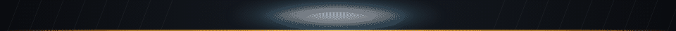

# ZAMMER — анимированный баннер 1920 × 90



Анимированный веб-баннер: логотип ZAMMER по центру, «АКЦИЯ» слева, «37 %» справа.
Световая волна идёт слева направо и по достижении акции поджигает её.

**Один SVG-файл. Ни JS, ни внешних шрифтов, ни картинок.** Логотип и весь текст
переведены в кривые, поэтому баннер выглядит одинаково на любом устройстве
и масштабируется без потерь.

---

## Файлы

| Файл | Что это |
|---|---|
| `zammer-banner.svg` | **Вариант A — основной.** «АКЦИЯ» слева, «37 %» справа |
| `zammer-banner-b.svg` | Вариант B. «АКЦИЯ 37 %» единым блоком справа от логотипа |
| `zammer-banner-light.svg` | Вариант A в светлой палитре |
| `zammer-logo.svg` | Логотип отдельным вектором (`fill: currentColor`) |
| `index.html` | Страница-превью: все три варианта + кнопка «проиграть заново» |
| `preview.gif` / `preview.png` | Превью для показа без браузера |
| `build.py`, `src/` | Генератор: из него собираются все SVG |

Посмотреть: откройте `index.html` в браузере (или сам `.svg` — он анимируется сразу).

## Встраивание

```html

```

SVG анимируется прямо внутри `` — подключать ничего не нужно.
Если баннер должен быть строго 90 px высотой и растягиваться на любую ширину,
поставьте контейнеру `height:90px` и добавьте в SVG
`preserveAspectRatio="xMidYMid slice"`.

## Тайминг

Появление — 0,9 с, дальше бесконечный цикл 6 с (полный первый проход — 6,9 с).

| Время | Что происходит |
|---|---|
| 0 – 0,9 с | логотип выезжает снизу с 3D-тенью, появляются «АКЦИЯ» и плашка — обе погашены |
| 1,2 – 3,9 с | световая волна идёт слева направо через весь баннер |
| 2,2 с | волна доходит до «АКЦИЯ» — текст загорается белым |
| 2,4 – 2,7 с | блик скользит по буквам логотипа, подсветка за ним вспыхивает |
| 2,8 с | волна доходит до акции: плашка загорается, цифры меняют цвет, летят искры |
| 3,0 – 6,1 с | «зажжённое» состояние, мягкое дыхание подсветки |
| 6,1 – 6,8 с | плавное гашение, цикл повторяется |

Волна идёт с постоянной скоростью, поэтому моменты подсветки элементов
рассчитываются автоматически по их координатам — при смене раскладки
тайминги пересчитаются сами.

## Доступность

При системной настройке «уменьшить движение» (`prefers-reduced-motion: reduce`)
анимация не запускается — показывается финальный «зажжённый» кадр.

## Пересборка

```bash
pip install fonttools
python3 build.py
```

Основные параметры — в шапке `build.py`:

* `LOGO_H`, `GAP`, `AK_SIZE`, `PC_SIZE` — размеры и раскладка;
* `LOOP`, `INTRO`, `WAVE_T0/T1`, `HOLD_END`, `DIM_END` — тайминг;
* `DARK` / `LIGHT` — палитры (цвет подсветки, «горячий» градиент акции, металл логотипа).

Чтобы поменять процент скидки, достаточно исправить строку `"37%"` в `build.py`
и пересобрать — ширина плашки и тайминг поджига подстроятся автоматически.

Разметка баннера лежит в `src/banner.svg.tpl` (шаблон `string.Template`,
подстановки вида `$NAME`).

## О логотипе

Исходный `logo_zammer.svg` пришёл пустым (0 байт), ссылки на исходники требовали
авторизации, поэтому вектор восстановлен трассировкой присланного растра
(`src/trace_logo.py` → `src/logo_path.txt`). Расхождение контура с оригиналом —
1,2 % площади, и это край антиалиасинга JPEG.

**Если появится оригинальный вектор**, заменить логотип просто: положите путь
логотипа (только абсолютные `M`/`L`, бокс 1153 × 202,73) в `src/logo_path.txt`
и пересоберите. При другом боксе поправьте `LOGO_SRC_W` / `LOGO_SRC_H` в `build.py`.
